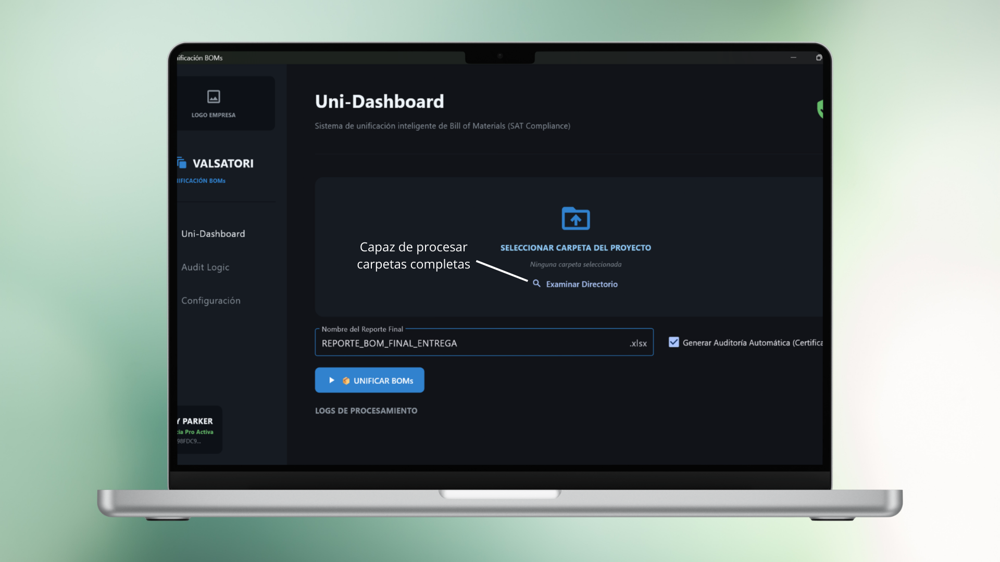

# 💎 Valsatori BOM Studio
### Enterprise Analytics Suite & Integrity Auditing Solution

**Valsatori BOM Studio** es un ecosistema industrial diseñado para la unificación inteligente de *Bill of Materials* (BOM). Su arquitectura se basa en un modelo **Cliente-Servidor (Sidecar)** donde el procesamiento se centraliza en un motor analítico remoto para garantizar seguridad, integridad y control de licencias.

---

## 🏗️ Arquitectura de Microservicios: Sidecar & FastAPI
A diferencia de las aplicaciones monolíticas, este proyecto implementa una separación estricta entre la interfaz y la lógica de negocio para proteger la propiedad intelectual (IP):

* **Front-end Local (Flet):** Una interfaz reactiva instalada en el equipo del usuario, diseñada para ofrecer una experiencia fluida y logs en tiempo real.
* **Motor Analítico Remoto (FastAPI):** El núcleo de la aplicación reside en un dominio seguro. Toda la manipulación de datos masivos y el cálculo de integridad se realiza a través de peticiones al API.
* **Gestión de Licencias:** El acceso al motor analítico está condicionado a la validación de licencias activas, permitiendo un control total sobre el despliegue industrial.

---

## 📸 Visual Insights

### Uni-Dashboard: Centralización de Procesos

### Certificación de Integridad (Match Logic)

---

### Resultado Final: Reportes de Alta Calidad

---

## 🛠️ Ventajas de esta Arquitectura
1. **Protección de la Propiedad Intelectual (IP):** El código sensible y los algoritmos de "Match Logic" nunca residen en la máquina del usuario final; se ejecutan exclusivamente en el servidor seguro.
2. **Zero-Inference Auditing:** Al centralizar el procesamiento en FastAPI, se garantiza que los reportes se generen bajo un estándar único, eliminando riesgos de manipulación local.
3. **Excel Gourmet:** Generación de archivos de salida con formato profesional, listos para presentaciones de nivel gerencial sin necesidad de edición manual.

### Resultado Final: Reportes de Alta Calidad

*Visualización de datos unificados con formato corporativo.*

*Resumen de integridad con estatus "PASSED" tras validar sumatorias y registros industriales.*

---

## 🔐 Seguridad Industrial e Integridad
Para blindar el software contra accesos no autorizados y asegurar la validez de los datos, integré:
* **HWID Binding:** Validación de identidad de hardware para asegurar que solo equipos autorizados consuman recursos del API.
* **JWT (JSON Web Tokens):** Gestión de sesiones seguras para la comunicación cifrada entre el cliente local y el backend.
* **Algoritmo Match Logic:** Motor especializado en procesar formatos complejos (MBOM, Matrix) y certificar su integridad aritmética automáticamente.

---

## 🧰 Stack Tecnológico
* **Backend:** Python 3.10+, FastAPI (Motor Analítico), Uvicorn.
* **Frontend:** Flet (Framework basado en Flutter para Python).
* **Data:** Pandas, OpenPyxl (Manipulación industrial de Excel).
* **Seguridad:** PyJWT, HWID Binding.

---

[⬅️ Volver al inicio](index.md)
